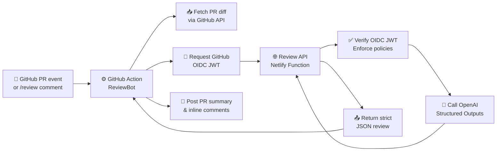
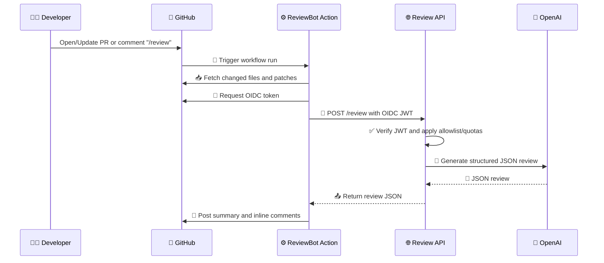

# 🤖 ReviewBot — Serverless AI Code Review with GitHub OIDC

> 🚀 Production-ready AI code review with zero shared secrets. Secure, fast, and serverless.

[](https://app.netlify.com/start/deploy)

## ✨ What is ReviewBot?

ReviewBot is a **zero-configuration AI code reviewer** that integrates seamlessly with GitHub pull requests. It uses OpenAI's structured outputs to provide intelligent, actionable feedback on your code changes.

**Two main components:**
1. 📦 **GitHub Action** (root) — Packages diffs, authenticates with GitHub OIDC, posts summaries + inline comments
2. ⚡ **Review API** (server/) — Netlify/Node serverless function that verifies OIDC, enforces security policies, and calls OpenAI

---

## 🎯 Key Highlights

✅ **Zero Secrets in Client Repos** — Uses short-lived GitHub OIDC tokens instead of API keys  
🎨 **One-Line Installation** — Drops workflow + config into any repository instantly  
☁️ **Netlify-Ready** — Ships with `netlify.toml` and pre-configured function handlers  
🛡️ **Enterprise Security** — Org/repo allow-lists, per-repo quotas, IP rate limiting  
🎯 **Smart Filtering** — Configurable severity & confidence thresholds  
⚡ **Zero Dependencies** — Action uses plain Node.js for optimal PR latency  
🔄 **Structured Outputs** — JSON Schema-enforced responses from OpenAI  

---

## 🏗️ Architecture

### High-Level Flow



### Sequence Diagram



---

## 🚀 Quick Start

### Step 1: Deploy the Review API (Netlify)

#### 📋 Prerequisites
- Netlify account
- OpenAI API key

#### ⚙️ Configuration

1. **In Netlify Dashboard:**
   - **Base directory:** `server`
   - **Functions directory:** `netlify/functions`
   - **Publish directory:** `public`

2. **Environment Variables (Required):**

| Variable | Description | Example |
|----------|-------------|---------|
| `OPENAI_API_KEY` | 🔑 Your OpenAI API key | `sk-proj-...` |
| `OIDC_AUDIENCE` | 🎫 OIDC token audience | `reviewbot-api` |
| `ALLOW_ORGS` | 🏢 Allowed GitHub orgs | `your-org,another-org` |
| `ALLOW_REPOS` | 📦 Allowed repositories | `owner/repo1,owner/repo2` |
| `ALLOW_ALL` | ⚠️ Allow all repos (dev only) | `false` |

3. **Optional Configuration:**

| Variable | Description | Default |
|----------|-------------|---------|
| `QUOTA_PER_REPO_PER_DAY` | 📊 Daily review quota | `50` |
| `RATE_LIMIT_PER_MINUTE` | ⏱️ Rate limit per IP | `10` |
| `OPENAI_MODEL` | 🤖 OpenAI model to use | `gpt-4o-2024-08-06` |
| `MIN_SEVERITY` | 🎯 Minimum severity level | `low` |
| `MIN_CONFIDENCE` | 📈 Minimum confidence | `medium` |

4. **Deploy & Verify:**
   ```bash
   # Health check endpoint
   curl https://YOUR_DOMAIN/.netlify/functions/review/health
   ```

---

### Step 2: Install into Any Repository

🎉 **One command installation:**

```bash
npx --yes github:Twist-Turn/ai-code-review-assistant install \
  --endpoint https://reviewagent.netlify.app/.netlify/functions/review
```

**What this does:**
- ✍️ Creates `.github/workflows/reviewbot.yml`
- 📝 Generates `.reviewbot.json` configuration
- 🔧 Auto-normalizes endpoint URL
- ✅ Sets up required GitHub permissions

**Required GitHub Permissions:**
```yaml
permissions:
  pull-requests: write  # Post inline comments
  issues: write        # Post summary comments
  id-token: write      # Generate OIDC tokens
```

---

## 💡 Usage

### 🤖 Automatic Reviews

ReviewBot automatically runs on:
- ✅ New pull request creation
- 🔄 Pull request updates
- 🏷️ Label changes (configurable)

### 🎮 Manual Trigger

Comment on any PR to trigger a custom review:

```bash
# Basic review
/review

# Focus on security with custom limits
/review focus=security max_comments=6 min_severity=low

# Performance-focused review
/review focus=performance max_comments=10 min_confidence=high

# Comprehensive review with all options
/review focus=all max_comments=15 min_severity=info min_confidence=low
```

**Available parameters:**

| Parameter | Values | Description |
|-----------|--------|-------------|
| `focus` | `security`, `performance`, `bugs`, `style`, `all` | Review focus area |
| `max_comments` | `1-50` | Maximum inline comments |
| `min_severity` | `info`, `low`, `medium`, `high`, `critical` | Minimum severity threshold |
| `min_confidence` | `low`, `medium`, `high` | Minimum confidence level |

---

## ⚙️ Configuration

### 📝 Repository Configuration (`.reviewbot.json`)

```json
{
  "version": "1.0",
  "policies": {
    "ignore_paths": [
      "**/node_modules/**",
      "**/dist/**",
      "**/build/**",
      "**/*.min.js",
      "**/package-lock.json",
      "**/yarn.lock"
    ],
    "skip_if_label_present": ["skip-review", "wip"],
    "max_file_size_kb": 500
  },
  "review": {
    "max_inline_comments": 10,
    "min_confidence": "medium",
    "min_severity_for_inline": "low",
    "focus_areas": ["security", "performance", "bugs"],
    "include_suggestions": true
  },
  "ai": {
    "model": "gpt-4o-2024-08-06",
    "temperature": 0.3,
    "max_tokens": 4000
  }
}
```

### 🎛️ Configuration Options Explained

#### 📂 Policies
- **`ignore_paths`** — Skip review for generated files, dependencies, build artifacts
- **`skip_if_label_present`** — Don't review PRs with specific labels
- **`max_file_size_kb`** — Skip files larger than this size

#### 🔍 Review Settings
- **`max_inline_comments`** — Limit comments to avoid noise (1-50)
- **`min_confidence`** — Filter low-confidence suggestions (`low`|`medium`|`high`)
- **`min_severity_for_inline`** — Threshold for inline comments
- **`focus_areas`** — Prioritize specific review categories
- **`include_suggestions`** — Include code improvement suggestions

#### 🤖 AI Settings
- **`model`** — OpenAI model selection
- **`temperature`** — Response randomness (0.0 = deterministic, 1.0 = creative)
- **`max_tokens`** — Maximum response length

---

## 🔒 Security & Limits

### 🛡️ Security Features

✅ **No Shared Secrets** — OpenAI keys stay server-side; clients use ephemeral OIDC tokens  
✅ **Allow-List Enforcement** — Only approved orgs/repos can access the API  
✅ **Quota Management** — Per-repo daily limits prevent abuse  
✅ **Rate Limiting** — IP-based throttling stops DDoS attempts  
✅ **JWT Verification** — GitHub's public JWKS validates every request  
✅ **Defense in Depth** — Helmet.js, CORS, and input validation  

### 🎯 Best Practices

**For Production:**
```bash
# ✅ Recommended
ALLOW_ALL=false
ALLOW_ORGS="your-org"
QUOTA_PER_REPO_PER_DAY=50
RATE_LIMIT_PER_MINUTE=10
```

**For Development:**
```bash
# ⚠️ Only for testing
ALLOW_ALL=true
QUOTA_PER_REPO_PER_DAY=1000
RATE_LIMIT_PER_MINUTE=100
```

### 📊 Quota System

| Tier | Daily Reviews | Best For |
|------|---------------|----------|
| 🥉 Small | 10-25 | Personal projects |
| 🥈 Medium | 25-100 | Small teams |
| 🥇 Large | 100-500 | Enterprise |
| ♾️ Unlimited | No limit | Internal deployment |

---

## 🛠️ Tech Stack

### Frontend (GitHub Action)
- 🟢 **Runtime:** Node.js 18
- 📦 **Dependencies:** Zero (pure Node for speed)
- 🔐 **Auth:** GitHub OIDC (`id-token: write`)
- 🌐 **API:** GitHub REST API v3

### Backend (Review API)
- ⚡ **Platform:** Netlify Functions (AWS Lambda)
- 🎯 **Framework:** ESM modules, Express-less handlers
- 🤖 **AI:** OpenAI Structured Outputs with JSON Schema
- 🔐 **Auth:** `jose` library for JWT/JWKS verification
- 🛡️ **Security:** `helmet`, custom rate limiting

### Infrastructure
```
┌─────────────────────────────────────────────┐
│            GitHub Repository                │
│  ┌─────────────────────────────────────┐   │
│  │   .github/workflows/reviewbot.yml   │   │
│  │   .reviewbot.json                   │   │
│  └─────────────────────────────────────┘   │
└─────────────────────┬───────────────────────┘
                      │
                      │ OIDC Token
                      ▼
         ┌────────────────────────┐
         │   Netlify Functions    │
         │  ┌──────────────────┐  │
         │  │  OIDC Verifier   │  │
         │  │  Allow-List      │  │
         │  │  Quota Manager   │  │
         │  │  Rate Limiter    │  │
         │  └──────────────────┘  │
         └───────────┬────────────┘
                     │
                     │ API Key
                     ▼
              ┌─────────────┐
              │   OpenAI    │
              │  GPT-4o     │
              └─────────────┘
```

---

## 📖 Examples

### 💬 Example Inline Comment

```diff
+ const query = `SELECT * FROM users WHERE id = ${userId}`;
```

> 🔴 **Critical - SQL Injection Vulnerability**
> 
> **Issue:** User input is directly interpolated into SQL query without sanitization.
> 
> **Risk:** Attackers can execute arbitrary SQL commands.
> 
> **Recommendation:**
> ```javascript
> const query = 'SELECT * FROM users WHERE id = ?';
> db.execute(query, [userId]);
> ```
> 
> **Confidence:** High | **Severity:** Critical

---

## 🤝 Contributing

We welcome contributions! Here's how you can help:

1. 🐛 **Report bugs** via GitHub Issues
2. 💡 **Suggest features** in Discussions
3. 🔧 **Submit PRs** for fixes or enhancements
4. 📚 **Improve docs** with examples and guides

### 🏃 Development Setup

```bash
# Clone the repo
git clone https://github.com/Twist-Turn/ai-code-review-assistant.git
cd ai-code-review-assistant

# Install server dependencies
cd server
npm install

# Set up environment variables
cp .env.example .env
# Edit .env with your values

# Run locally with Netlify CLI
npm install -g netlify-cli
netlify dev
```

---

## 📄 License

MIT License - see [LICENSE](LICENSE) file for details.

---

## 🙏 Acknowledgments

- 🤖 **OpenAI** for GPT-4o and Structured Outputs API
- 🐙 **GitHub** for OIDC and Actions platform
- ⚡ **Netlify** for serverless function hosting
- 👥 **Open Source Community** for inspiration and feedback

---


<div align="center">

**Made with ❤️ by developers, for developers**

⭐ Star us on GitHub if ReviewBot helps your team! ⭐

</div>
