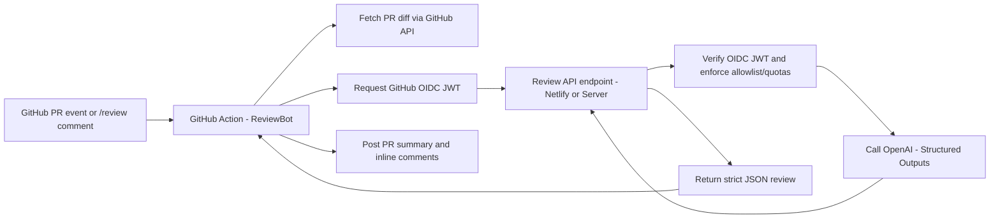
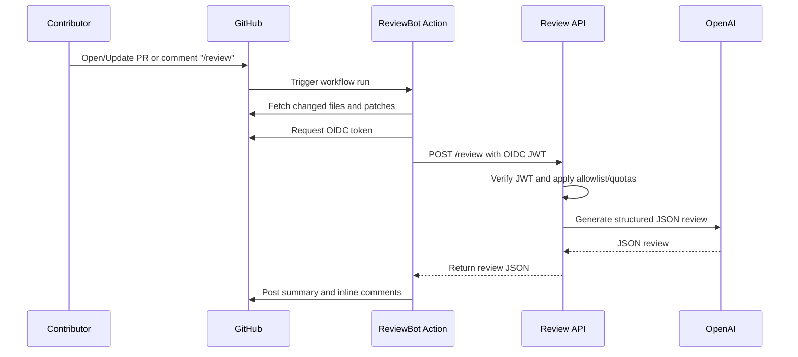

# ReviewBot — Serverless AI code review with GitHub OIDC (no repo secrets)

Built to showcase production-ready AI review with zero shared secrets. Two pieces:

1) **GitHub Action** (root) — packages diffs, uses GitHub OIDC, posts summary + inline comments.  
2) **Review API** (server/) — Netlify/Node function that verifies OIDC, enforces allow-list + quota, and calls OpenAI Structured Outputs.

## Highlights
- No secrets in consuming repos: short-lived GitHub OIDC token only.
- One-line installer: drops workflow + config into any repo.
- Netlify-ready: repo ships `netlify.toml` and a function at `/.netlify/functions/review`.
- Safety controls: org/repo allow-lists, per-repo quotas, IP rate limit, severity & confidence filters.
- Action has zero external deps (plain Node), optimized for PR latency.

## Architecture



## Deploy the Review API (Netlify, easiest)
1) In Netlify: set Base directory `server`, Functions `netlify/functions`, Publish `public`.  
2) Env vars (minimum):  
   - `OPENAI_API_KEY`  
   - `OIDC_AUDIENCE=reviewbot-api` (or your value)  
   - Allow-list: `ALLOW_ORGS="your-org"` **or** `ALLOW_REPOS="owner/repo,owner2/repo2"`; keep `ALLOW_ALL=false`.  
   - Optional: `QUOTA_PER_REPO_PER_DAY`, `RATE_LIMIT_PER_MINUTE`, `OPENAI_MODEL`.
3) Deploy. Health check: `GET https://YOUR_DOMAIN/.netlify/functions/review/health`.

## Install into any repo (one command)
Run inside the target repo:
```bash
npx --yes github:Twist-Turn/ai-code-review-assistant install --endpoint https://reviewagent.netlify.app/.netlify/functions/review
```
- Installer writes `.github/workflows/reviewbot.yml` and `.reviewbot.json` in the current folder.
- Endpoint auto-normalizes to `https://YOUR_DOMAIN/.netlify/functions/review`.
- Workflow passes `github_token: ${{ github.token }}`; ensure `permissions: pull-requests: write` (and `issues: write` for summary comments).

Trigger manually in PR comments:
```
/review focus=security max_comments=6 min_severity=low
```

## Configure (lightweight)
Edit `.reviewbot.json` to tune:
- `policies.ignore_paths` (skip generated dirs)
- `policies.skip_if_label_present`
- `review.max_inline_comments`, `review.min_confidence`, `review.min_severity_for_inline`

## Security & limits
- OpenAI key stays server-side; clients only hold OIDC tokens.
- Allow-lists + quota + IP rate limiting enabled by default.
- Keep `ALLOW_ALL=false` unless running in a closed environment.

## Tech stack
- GitHub Actions (Node 18 runtime, no deps)
- Netlify Functions (ESM, Express-less handler)
- OpenAI Responses API with JSON Schema enforcement
- jose for JWT/JWKS (OIDC), helmet + rate limiting for defense in depth
